# 基于Java+Springboot+Vue协同过滤算法招聘兼职小程序

## 获取地址

#### 作者QQ：3275035005 微信：xkbishe123 (支持修改、 部署调试、 代做接毕业设计和课程设计)

#### 接网站建设、小程序、H5、APP、各种系统、样式修改等

#### 选题+开题报告+任务书+程序定制+安装调试+论文+答辩ppt 都可以做

#### 问题包修改，包满意，有需求尽管甩过来！一条龙帮你安心过！

#### 所有项目以及源代码本人均调试运行无问题 可支持远程调试运行

#### 送万字文档，讲解视频，如需项目源码请添加联系方式。

## 1. 技术栈

​	技术架构：前后端分离     B/S架构    MVC架构

​	后端框架：Springboot + Mybatis

​	前端框架：Vue + ElementUI

​	小程序：Uniapp

​	数据库：Mysql

​	开发工具：IDEA、微信开发者工具、HBuilder、Navicat 

## 2. 功能概述

### 2.1 **管理端功能**

​	**登录、首页、个人信息、修改密码**

​	**信息管理**：轮播图信息管理、企业信息管理

​	**系统管理**：普通用户管理、企业用户管理、修改密码、个人中心

### 2.2 **企业端功能**

​	**登录、首页、个人信息、修改密码**

​	**兼职管理**：兼职信息管理

​	**面试管理**：面试审核、面试记录

​	**我的消息**：面试用户在线沟通、发送简历

​	**系统管理**：用户管理、企业用户、密码修改、个人中心

### 2.3 **小程序端功能**

​	**登录、个人信息**

​	**工作页面**：系统过滤推荐新岗位查看、最新岗位查看、岗位搜索

​	**消息页面**：查看我的消息、发送消息、发送简历

​	**岗位页面**：岗位详情、立即联系、投递简历、岗位收藏

​	**我的页面**：沟通中、待面试、已完成面试，我的简历、我的收藏岗位、用户设置

## 3. 系统页面

### 3.1 **小程序端功能**

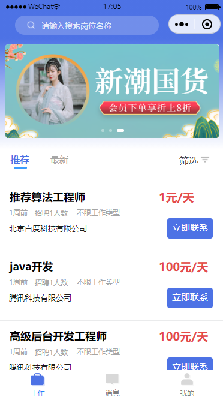

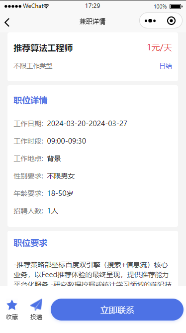

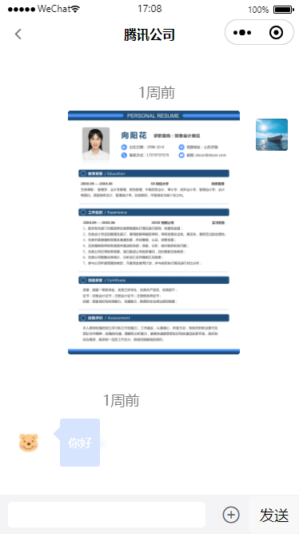

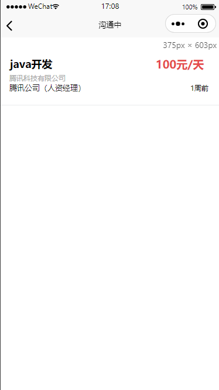

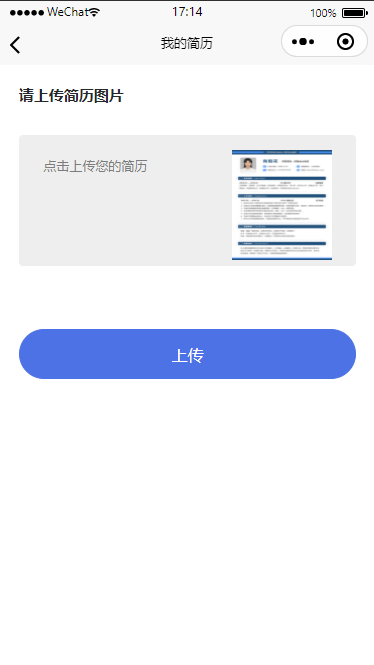

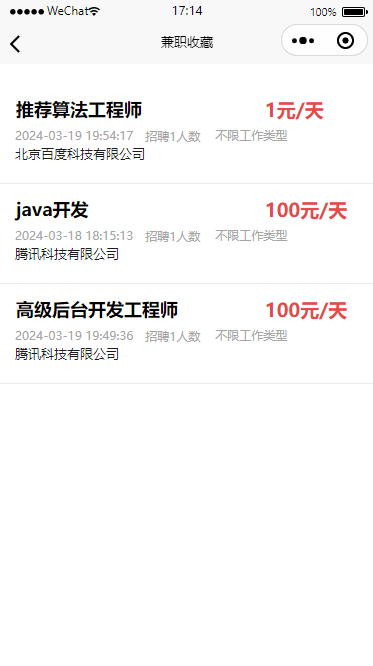

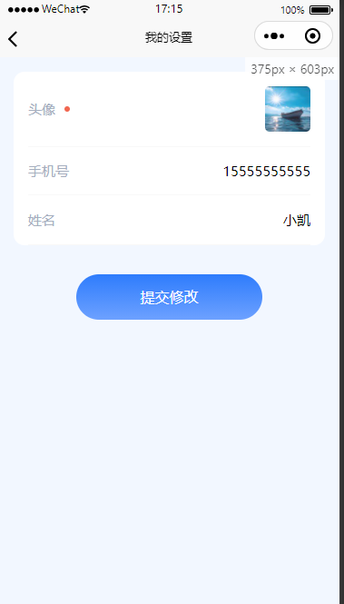

### 3.2 管理端功能

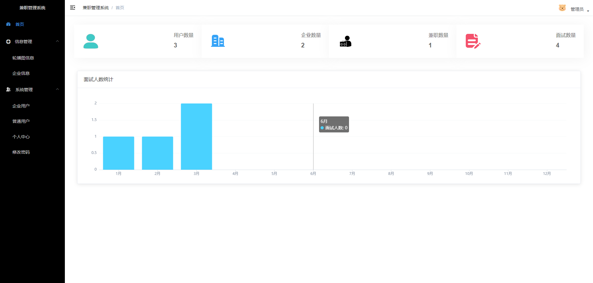

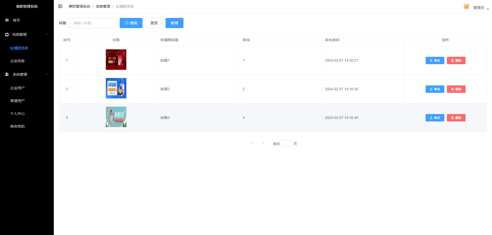

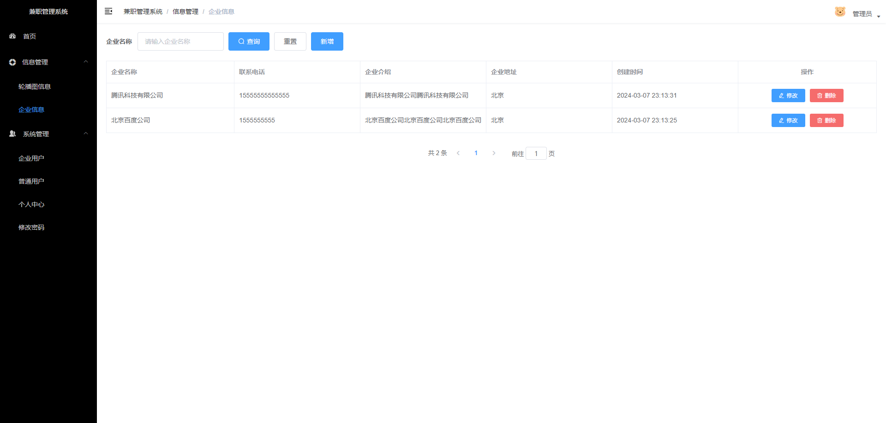

#### 

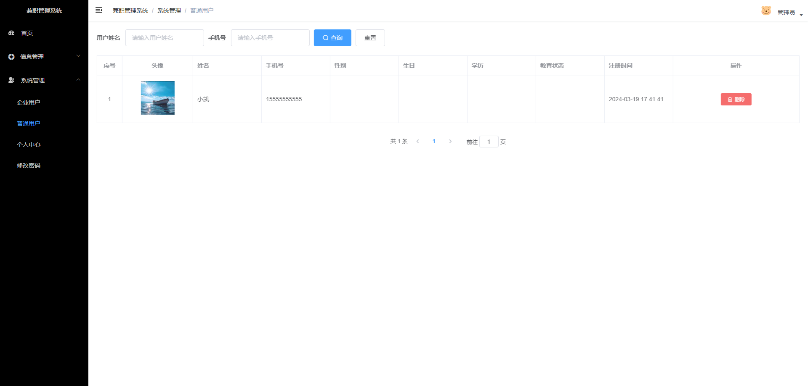

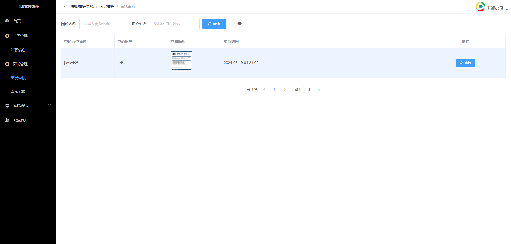

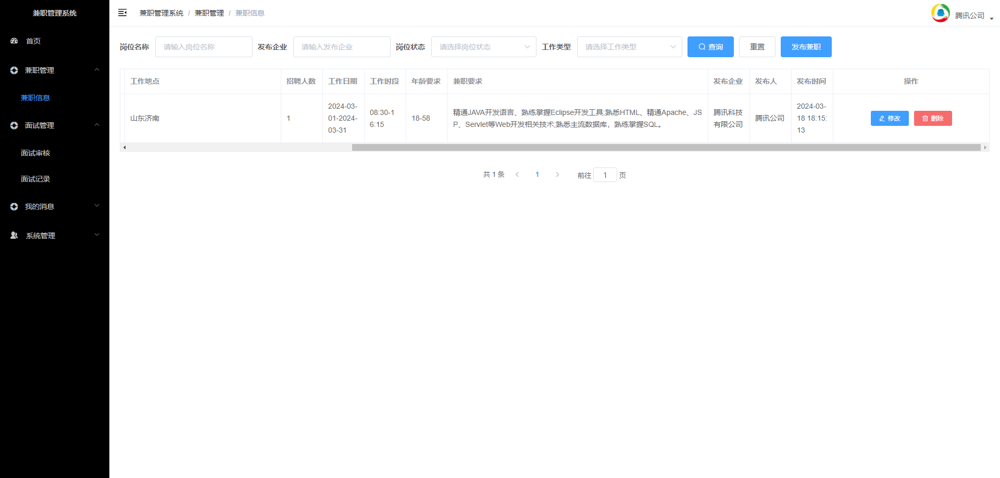

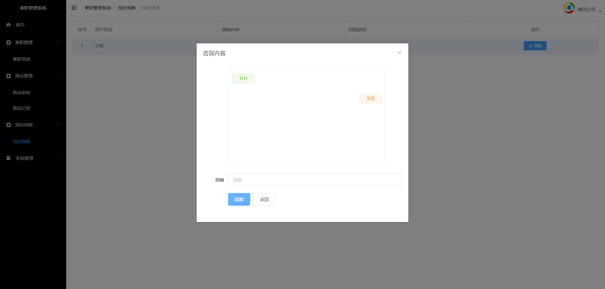

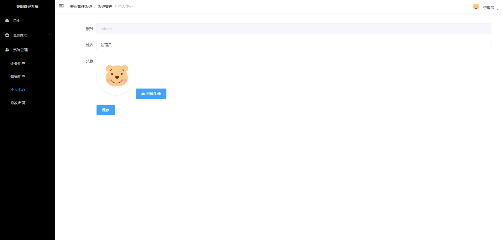

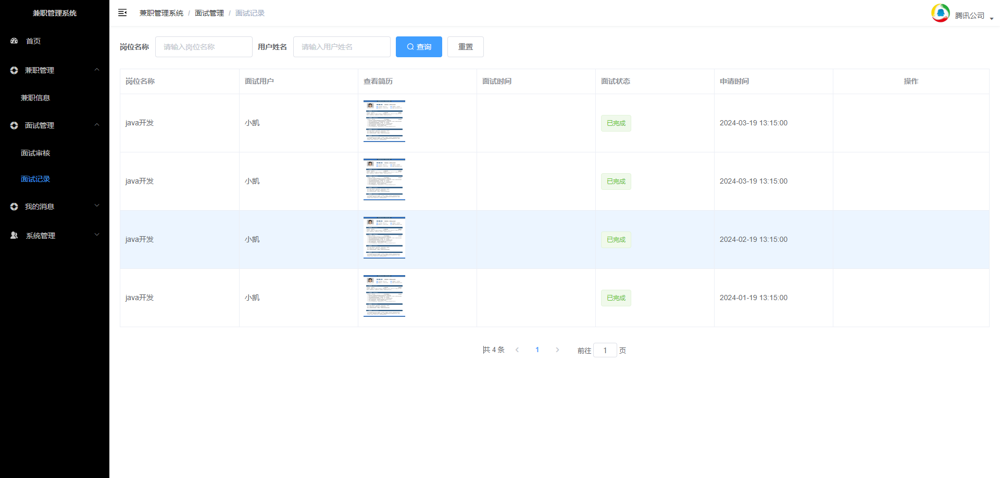

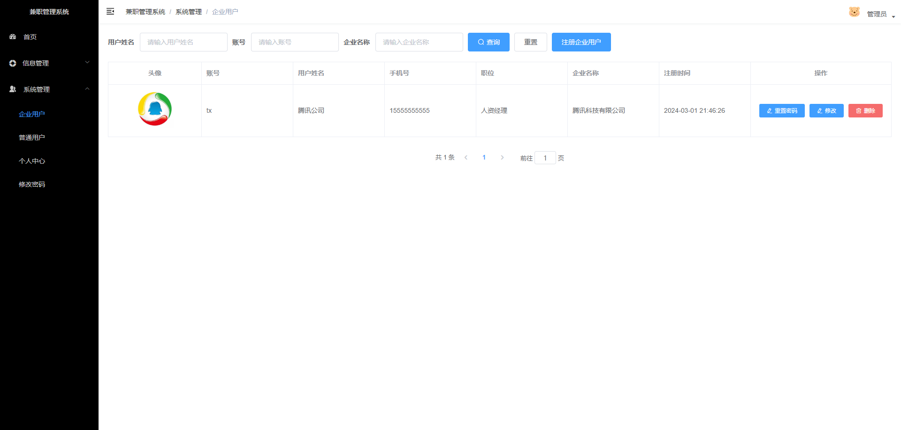

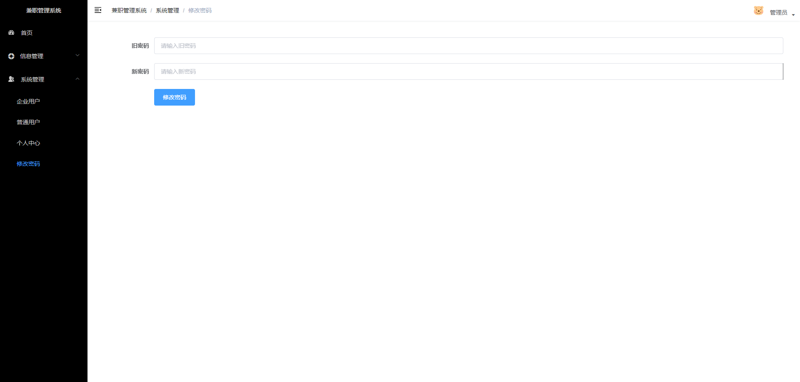

